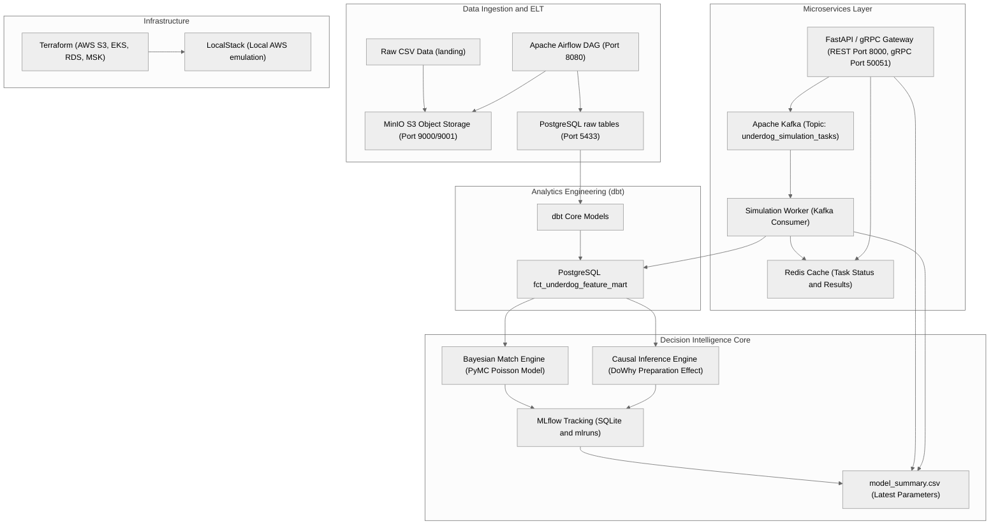

# UnderdogAI

Decision Intelligence and Predictive Football Analytics Platform designed to identify underdogs, simulate tournaments, and predict match-level upset probabilities at FIFA World Cups.

---

## Table of Contents
1. [System Architecture](#system-architecture)
2. [Platform Components](#platform-components)
    - [Data Ingestion & ELT](#1-data-ingestion--elt)
    - [Analytics Engineering (dbt)](#2-analytics-engineering-dbt)
    - [Decision Intelligence Core](#3-decision-intelligence-core)
    - [Microservices Layer](#4-microservices-layer)
3. [Repository Directory Structure](#repository-directory-structure)
4. [Local Emulation Infrastructure](#local-emulation-infrastructure)
5. [Step-by-Step Execution Guide](#step-by-step-execution-guide)
    - [Prerequisites](#prerequisites)
    - [Step 1: Start Emulated Infrastructure](#step-1-start-emulated-infrastructure)
    - [Step 2: Run Data Ingestion (Airflow)](#step-2-run-data-ingestion-airflow)
    - [Step 3: Run Transformations (dbt)](#step-3-run-transformations-dbt)
    - [Step 4: Train Bayesian & Causal Models](#step-4-train-bayesian--causal-models)
    - [Step 5: Spin up Gateway & Workers](#step-5-spin-up-gateway--workers)
6. [API Usage & Verification](#api-usage--verification)
    - [REST Gateway endpoints](#rest-gateway-endpoints)
    - [gRPC Services](#grpc-services)
7. [Cloud Deployment Mechanics (Terraform)](#cloud-deployment-mechanics-terraform)

---

## System Architecture

UnderdogAI is built on a modular data-to-decision architecture combining streaming event meshes, Bayesian statistics, and causal inference. The diagram below illustrates how raw landing-zone datasets transition into feature stores, feed model training pipelines, and power real-time REST and gRPC endpoints.



---

## Platform Components

### 1. Data Ingestion & ELT
* **Orchestration**: Apache Airflow schedules and coordinates ingestion tasks under the [`elt_underdog_pipeline`](file:///c:/Users/mjeni/OneDrive/Desktop/Own%20Projects/UnderdogAI/airflow/dags/elt_underdog_pipeline.py) DAG.
* **Extraction**: Bootstraps the MinIO S3 object store by reading raw CSV data (`results.csv`, `shootouts.csv`, and `fifa_ranking-2026-01-19.csv`) from the landing directory and staging them in a `landing` bucket.
* **Validation & Storage**: The Python pipeline performs schema enforcement, type validation, and inserts records into a local analytical PostgreSQL instance (`raw_match_results`, `raw_shootouts`, and `raw_fifa_rankings`).

### 2. Analytics Engineering (dbt)
* **Transformation**: Utilizes [dbt Core](file:///c:/Users/mjeni/OneDrive/Desktop/Own%20Projects/UnderdogAI/dbt) to transform raw staging views into clean, relational analytical tables.
* **Temporal Joining**: Maps match historical records to team FIFA rankings closest to the respective match dates.
* **Feature Mart**: The model output is loaded into [`fct_underdog_feature_mart`](file:///c:/Users/mjeni/OneDrive/Desktop/Own%20Projects/UnderdogAI/dbt/models/marts/fct_underdog_feature_mart.sql), exposing rank differentials, 12-month ranking volatility (using rolling standard deviations), 5-match rolling points velocity (form factors), and calculated candidate underdog signal scores.

### 3. Decision Intelligence Core
* **Bayesian Match Simulation**: Constructed in PyMC ([`bayesian_match_engine.py`](file:///c:/Users/mjeni/OneDrive/Desktop/Own%20Projects/UnderdogAI/src/models/bayesian_match_engine.py)). Models match score outcomes as independent Poisson processes where goals are determined by:
  
  $$
  \lambda_{\text{home}} = \exp(\text{intercept} + \text{home\_adv} + \theta_{\text{home}} - \theta_{\text{away}} + \beta_{\text{diff}}\Delta\text{Rank} + \beta_{\text{vel}}\text{Vel}_{\text{home}} + \beta_{\text{vol}}\text{Vol}_{\text{home}})
  $$
  
  $$
  \lambda_{\text{away}} = \exp(\text{intercept} + \theta_{\text{away}} - \theta_{\text{home}} - \beta_{\text{diff}}\Delta\text{Rank} + \beta_{\text{vel}}\text{Vel}_{\text{away}} + \beta_{\text{vol}}\text{Vol}_{\text{away}})
  $$
  
  The model estimates latent team strengths ($\theta$) and regression coefficients using MCMC sampling. Experiment logs, Brier score calibration, log loss, and serialized parameters (`model_summary.csv`) are uploaded to MLflow.
* **Causal Inference Analysis**: Implemented via Microsoft's DoWhy ([`causal_inference_engine.py`](file:///c:/Users/mjeni/OneDrive/Desktop/Own%20Projects/UnderdogAI/src/models/causal_inference_engine.py)). Isolates the Average Treatment Effect (ATE) of high team preparation (treatment defined as friendly match point velocity $\ge 1.5$ over the 2 years leading to a tournament) on World Cup match wins, controlling for confounding variables like team rank, opponent rank, and historical volatility. Establishes statistical validity through Placebo Treatment and Random Common Cause refutation.

### 4. Microservices Layer
* **FastAPI Gateway**: Exposes API endpoints for immediate single-match predictions and asynchronous tournament simulations. It initializes an internal gRPC server (port 50051) on startup supporting identical requests.
* **Event Broker**: Uses Kafka to decouple prediction requests from long-running simulation workloads, publishing tasks to the `underdog_simulation_tasks` topic.
* **Simulation Worker**: Listens as a Kafka consumer, loads the latest Bayesian model parameters from MLflow's summary outputs, queries the PostgreSQL feature store, executes a Monte Carlo tournament simulation (including brackets and tie-breakers), and caches final probability scores to Redis.

---

## Repository Directory Structure

```
├── airflow/            # Airflow configurations and volumes
│   └── dags/           # Ingests raw data from MinIO S3 bucket to PostgreSQL
├── dags/               # Root mapping placeholder (empty directory)
├── data/
│   └── landing/        # Local storage hosting raw CSV datasets
├── dbt/                # dbt analytics engineering transformations
│   ├── models/         # SQL staging, intermediate, and analytics mart models
│   ├── dbt_project.yml # dbt configuration parameters
│   └── profiles.yml    # Database credential mapping for dbt CLI
├── mlruns/             # MLflow run executions, parameters, and metadata storage
├── src/                # Core Application codebase
│   ├── api/            # Gateway controller exposing REST and gRPC servers
│   ├── models/         # PyMC Bayesian modeling and DoWhy Causal Inference execution
│   ├── proto/          # Protocol buffer service contracts and generated modules
│   └── workers/        # Kafka consumer running Monte Carlo simulations
├── terraform/          # IaC provisioning modules for AWS / LocalStack deployment
├── docker-compose.yml  # Local stack configuration (PostgreSQL, Kafka, Redis, MinIO, Airflow)
└── CLAUDE.md           # Quick commands guide and styling instructions
```

---

## Local Emulation Infrastructure

The docker environment spins up local emulators representing production cloud configurations:

| Service | Port (Container) | Port (Host / External) | Purpose |
| :--- | :--- | :--- | :--- |
| **PostgreSQL (`db`)** | `5432` | `5433` | Analytical Sandbox (Stores feature store tables) |
| **Airflow Metastore** | `5432` | N/A | Airflow database backing orchestration state |
| **Airflow Webserver** | `8080` | `8080` | DAG visualization & execution interface |
| **MinIO Console** | `9001` | `9001` | S3 Emulator Admin Console |
| **MinIO API** | `9000` | `9000` | S3 Emulator bucket interface |
| **Redis** | `6379` | `6379` | Simulation task status cache |
| **Apache Kafka** | `9092` | `9092` | Asynchronous task streaming |

---

## Step-by-Step Execution Guide

### Prerequisites
* [Docker Desktop](https://www.docker.com/products/docker-desktop/) (ensure it is running)
* Python 3.10+ virtual environment

```bash
# Set up Python virtual environment
python -m venv venv
venv\Scripts\activate

# Install required python modules (PyMC, DoWhy, FastAPI, gRPC, Kafka, dbt)
pip install -r requirements.txt
```

> [!NOTE]
> If a `requirements.txt` is not present, you can install the core packages directly:
> `pip install pymc arviz dowhy fastapi uvicorn confluent-kafka redis psycopg2-binary dbt-postgres grpcio grpcio-tools pandas numpy mlflow`

### Step 1: Start Emulated Infrastructure
Spin up the local Docker container stack:
```bash
docker compose up -d
```
Verify all services are running:
```bash
docker compose ps
```

### Step 2: Run Data Ingestion (Airflow)
1. Open the Apache Airflow UI at http://localhost:8080.
2. Log in using credentials: Username `admin` / Password `admin`.
3. Locate the `elt_underdog_pipeline` DAG.
4. **Unpause** the DAG and trigger it manually. This runs:
   - `ingest_match_results`
   - `ingest_shootouts`
   - `ingest_fifa_rankings`
5. Once complete, raw datasets are validated and uploaded to PostgreSQL.

### Step 3: Run Transformations (dbt)
Execute dbt transformations to compile the PostgreSQL analytics tables:
```bash
cd dbt
dbt run
cd ..
```
This materializes `fct_underdog_feature_mart` inside the `analytical_sandbox` database, establishing feature columns for modeling.

### Step 4: Train Bayesian & Causal Models
1. **Train Bayesian Match Model**:
   ```bash
   python src/models/bayesian_match_engine.py
   ```
   *Trains PyMC goal-prediction dynamics, writes parameters to `model_summary.csv` inside `mlruns`, and posts accuracy ratings to MLflow.*

2. **Run Causal Treatment Studies**:
   ```bash
   python src/models/causal_inference_engine.py
   ```
   *Isolates pre-tournament preparation effects using DoWhy, verifies with refutation routines, and logs metrics.*

3. **Launch MLflow UI** (Optional):
   ```bash
   mlflow ui --port 5000
   ```
   *Browse models and metrics by visiting http://localhost:5000.*

### Step 5: Spin up Gateway & Workers
1. **Start the API & gRPC Gateway**:
   ```bash
   uvicorn src.api.gateway:app --host 0.0.0.0 --port 8000
   ```
   *Exposes the REST endpoints at port 8000 and activates the internal gRPC worker server at port 50051.*

2. **Start the Simulation Consumer Worker**:
   Open a separate shell/terminal, activate your virtual environment, and run:
   ```bash
   python src/workers/simulation_worker.py
   ```
   *Consumes Kafka event requests, runs Monte Carlo knock-outs, and registers outcomes to Redis.*

---

## API Usage & Verification

### REST Gateway endpoints

#### 1. Single-Match Predictor
Computes probabilities for Win/Draw/Loss outcomes based on statistical historical inputs.
* **Endpoint**: `GET /api/v1/predict`
* **Parameters**:
  * `home` (string): Home team name
  * `away` (string): Away team name
* **Example Request**:
  ```bash
  curl "http://localhost:8000/api/v1/predict?home=Brazil&away=Cameroon"
  ```
* **Response**:
  ```json
  {
    "home_win_prob": 0.612,
    "away_win_prob": 0.185,
    "draw_prob": 0.203,
    "underdog_signal_score": 182.4
  }
  ```

#### 2. Submit Tournament Simulation Task
Launches a background Monte Carlo simulation of a specific World Cup bracket.
* **Endpoint**: `POST /api/v1/simulate`
* **Request Payload**:
  ```json
  {
    "tournament_year": 2022,
    "simulation_runs": 1000
  }
  ```
* **Example Request**:
  ```bash
  curl -X POST "http://localhost:8000/api/v1/simulate" \
       -H "Content-Type: application/json" \
       -d '{"tournament_year": 2022, "simulation_runs": 1000}'
  ```
* **Response**:
  ```json
  {
    "task_id": "4e7235a9-e85d-4f10-9c2b-cbef71a2e88a"
  }
  ```

#### 3. Fetch Tournament Simulation Results
Retrieves task status and win probability mapping per nation.
* **Endpoint**: `GET /api/v1/simulate/status/{task_id}`
* **Example Request**:
  ```bash
  curl "http://localhost:8000/api/v1/simulate/status/4e7235a9-e85d-4f10-9c2b-cbef71a2e88a"
  ```
* **Response**:
  ```json
  {
    "task_id": "4e7235a9-e85d-4f10-9c2b-cbef71a2e88a",
    "status": "COMPLETED",
    "result": {
      "Argentina": 0.182,
      "France": 0.154,
      "Brazil": 0.141,
      ...
    }
  }
  ```

### gRPC Services

The system compiled contract protocols ([`simulation.proto`](file:///c:/Users/mjeni/OneDrive/Desktop/Own%20Projects/UnderdogAI/src/proto/simulation.proto)) are served locally on port `50051`.

You can compile protocol files or inspect with gRPC CLI testing tools like `grpcurl`:
```bash
# Inspect gRPC services
grpcurl -plaintext localhost:50051 list

# Call PredictMatch gRPC Method
grpcurl -plaintext -d '{"home_team": "Brazil", "away_team": "Cameroon"}' localhost:50051 simulation.SimulationService/PredictMatch
```

---

## Cloud Deployment Mechanics (Terraform)

Production cloud deployment files are provided inside the [`terraform`](file:///c:/Users/mjeni/OneDrive/Desktop/Own%20Projects/UnderdogAI/terraform) folder. To plan or apply using LocalStack or AWS:

1. **Initialize Terraform Modules**:
   ```bash
   cd terraform
   terraform init
   ```
2. **Review Plan Outputs**:
   ```bash
   terraform plan
   ```
3. **Provision Resources**:
   ```bash
   terraform apply
   ```

> [!WARNING]
> By default, `use_localstack` is set to `true` in [`variables.tf`](file:///c:/Users/mjeni/OneDrive/Desktop/Own%20Projects/UnderdogAI/terraform/variables.tf). To deploy to real AWS clusters, override this variable by specifying `-var="use_localstack=false"` or updating parameter configs.
