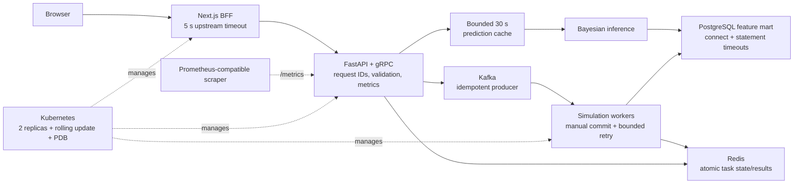
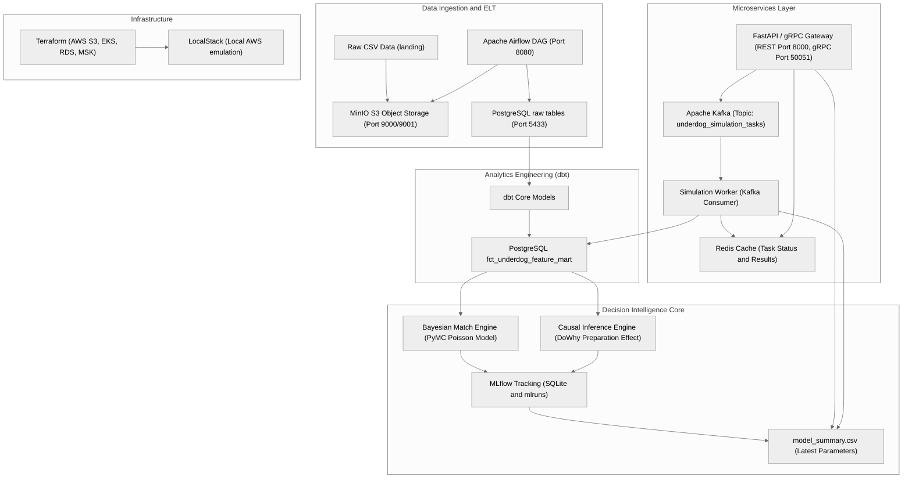

# UnderdogAI

Decision Intelligence and Predictive Football Analytics Platform designed to identify underdogs, simulate tournaments, and predict match-level upset probabilities at FIFA World Cups.

---

## Production Reliability Upgrade

### Flagship data-to-decision controls

The reproducibility path is `raw CSV → Airflow ingestion → PostgreSQL raw tables → dbt staging/intermediate models → feature mart → MLflow/model summary → API and worker inference`. `src/data_contracts.py` validates the three landing schemas, required types/ranges/dates and schema order before Airflow opens a database connection or truncates a raw table. dbt retains its `on_schema_change='fail'` mart guard and data tests. CSV bytes, schema fingerprints, relevant config hashes, MLflow run summaries and temporal boundaries are recorded by `benchmarks/flagship_report.py`.

Model splitting is chronological: train before 2018-01-01, validation from 2018-01-01 through 2019-12-31, and test from 2020-01-01 onward. Ranking joins remain as-of the match date. Team-rank priors now use training rows only; test-period coefficient fitting was removed. The posterior predictive test path logs multiclass Brier, log loss and per-outcome reliability bins. It does not yet select/calibrate hyperparameters using the reserved validation rows.

The generated report is `benchmarks/flagship_report.md` with its machine-readable `reproducibility_manifest.json`. These are ignored generated files, like model/data artifacts. `benchmarks/failure_matrix.py` exercises the current worker retry policy with controlled doubles; it is a policy simulation, not an end-to-end Kafka/Redis/Postgres outage test. In this environment it recorded 7 retry recoveries across requested fault labels, zero duplicate executions, and one terminally failed task after the retry budget. Retry sleeps are disabled in that matrix, so it reports configured backoff rather than elapsed recovery time.

Stored MLflow artifacts contain parameter summaries, not per-match outcome probabilities. Therefore current Brier/log-loss/reliability metrics cannot be independently regenerated without a fresh database-backed model run. The historical operational benchmark below remains historical and was not rerun here. Causal output is an observational estimate under its adjustment assumptions; placebo, random-common-cause, and subset refuters are checks, not proof of causality.

The existing data, model, REST/gRPC, Kafka, Redis, and Next.js architecture is preserved. The production path now adds bounded prediction caching, dependency-aware health checks, Prometheus-format metrics, failure-safe queue processing, frontend timeouts, resilient polling, non-root containers, rolling Kubernetes deployments, and CI/CD image publishing.


```mermaid
flowchart LR
    User["Browser"] --> FE["Next.js BFF<br/>5 s upstream timeout"]
    FE --> API["FastAPI + gRPC<br/>request IDs, validation, metrics"]
    API --> Cache["Bounded 30 s<br/>prediction cache"]
    Cache --> Model["Bayesian inference"]
    Model --> PG["PostgreSQL feature mart<br/>connect + statement timeouts"]
    API --> Kafka["Kafka<br/>idempotent producer"]
    Kafka --> Workers["Simulation workers<br/>manual commit + bounded retry"]
    Workers --> PG
    Workers --> Redis["Redis<br/>atomic task state/results"]
    API --> Redis
    Prometheus["Prometheus-compatible scraper"] -. "/metrics" .-> API
    K8s["Kubernetes<br/>2 replicas + rolling update + PDB"] -. manages .-> FE
    K8s -. manages .-> API
    K8s -. manages .-> Workers
```

### Reliability and Operations

| Area | Implemented behavior |
|---|---|
| API reliability | Validates simulation year/run count/mode, returns safe 503 responses for unavailable dependencies, rejects unknown task IDs with 404, and bounds PostgreSQL connection/statement time. |
| Caching | Per-replica, thread-safe, 1,024-entry prediction cache with a configurable 30-second TTL; misses remain in the worker thread pool and hits stay on the async request path. |
| Observability | Structured request logs, caller-provided or generated `X-Request-ID`, Prometheus histogram/counter output at `/metrics`, and dependency state at `/health/ready`. |
| Fault recovery | Kafka idempotent publishing; worker offsets commit only after Redis atomically stores the result; duplicate completed jobs are ignored; transient jobs retry after 1 s and 2 s before terminal failure. |
| Frontend | Native 5-second upstream timeout on prediction/simulation routes and tolerance for two consecutive transient status-poll failures. |
| Deployment | Non-root API/worker/frontend images, Compose health ordering, two-replica frontend/API/worker Kubernetes deployments, rolling updates, startup/readiness/liveness probes, and PodDisruptionBudgets. |
| CI/CD | Backend lint/tests, frontend lint/production build, four container builds, build cache, and immutable SHA plus `latest` GHCR publication on `main`. |

Configuration knobs:

| Variable | Default | Purpose |
|---|---:|---|
| `PREDICTION_CACHE_TTL_SECONDS` | `30` | Prediction freshness window. |
| `PREDICTION_CACHE_SIZE` | `1024` | Maximum cached prediction keys per API replica. |
| `POSTGRES_CONNECT_TIMEOUT_SECONDS` | `3` | Database connection deadline. |
| `POSTGRES_STATEMENT_TIMEOUT_MS` | `5000` | Database statement deadline. |
| `GATEWAY_TIMEOUT_MS` | `5000` | Next.js-to-FastAPI deadline. |
| `GRPC_ENABLED` | `true` | Enables the embedded gRPC listener. Set `false` in REST-only tests. |

Health and metrics:

```bash
curl http://localhost:8000/health/live
curl http://localhost:8000/health/ready
curl http://localhost:8000/metrics
```

`/health/live` only confirms that the process event loop is alive. `/health/ready` returns 503 when PostgreSQL is unavailable and also reports Redis/Kafka state without taking prediction traffic offline when only the asynchronous simulation path is degraded.

### Verified Performance

The committed [benchmark results](benchmarks/results.json) were measured on Windows with Python 3.12.6 against the real Uvicorn/FastAPI HTTP boundary. A deterministic 20 ms inference fixture isolates gateway/cache behavior because PostgreSQL, Redis, Kafka, and Docker were not running locally. The before column is the captured baseline run; the after column is the per-metric median of three final-code runs. These are controlled request-path results, not database end-to-end claims.

| 1,000 requests, concurrency 50 | Before | After | Change |
|---|---:|---:|---:|
| Throughput | 352.29 req/s | 553.08 req/s | **+57.00%** |
| P50 latency | 138.95 ms | 87.32 ms | **-37.16%** |
| P95 latency | 152.80 ms | 112.84 ms | **-26.15%** |
| P99 latency | 174.61 ms | 123.77 ms | **-29.12%** |
| Server CPU time | 2.84 s | 1.64 s | **-42.25%** |
| Peak server RSS | 86.44 MiB | 77.43 MiB | **-10.42%** |
| HTTP failures | 0 | 0 | unchanged |

Fault injection verified recovery from two consecutive worker failures in **3.00 seconds** using 1-second and 2-second backoff, with zero offset commits before successful processing. Before the change the worker had zero application retries and automatic offset commits, so the same injected sequence did not have an application recovery path.

Reproduce the checks:

```bash
pytest -q
npm --prefix frontend run lint
npm --prefix frontend run build
python benchmarks/recovery_test.py

# Terminal 1: controlled inference dependency
BENCHMARK_INFERENCE_DELAY=0.02 GRPC_ENABLED=false uvicorn benchmarks.fixture_app:app --port 8010

# Terminal 2: add --pid <server-pid> for CPU/RSS collection
python scripts/load_test.py "http://127.0.0.1:8010/api/v1/predict?home=Brazil&away=France&year=2022" --requests 1000 --concurrency 50 --warmup 20
```

The backend suite now contains **25 passing, zero-skipped tests** in this run. The frontend previously passed ESLint and the Next.js production build/type-check, generating all 16 application/API routes. `docker compose config --quiet` previously validated the full-stack service definition without requiring a running Docker daemon; neither frontend build nor Compose validation was rerun in this update.

### Run the Full Stack

```bash
docker compose up --build
```

This starts the frontend (`:3000`), REST API (`:8000`), gRPC (`:50051`), worker, PostgreSQL, Redis, Kafka/Zookeeper, MinIO, and Airflow services. Run the existing ingestion/dbt/model steps below before requesting data-backed predictions.

---

## Table of Contents
1. [Production Reliability Upgrade](#production-reliability-upgrade)
2. [System Architecture](#system-architecture)
3. [Key Design Decisions](#key-design-decisions)
4. [Platform Components](#platform-components)
    - [Data Ingestion & ELT](#1-data-ingestion--elt)
    - [Analytics Engineering (dbt)](#2-analytics-engineering-dbt)
    - [Decision Intelligence Core](#3-decision-intelligence-core)
    - [Microservices Layer](#4-microservices-layer)
5. [Event-Driven Architecture](#event-driven-architecture)
6. [Analytics Layer](#analytics-layer)
7. [Repository Directory Structure](#repository-directory-structure)
8. [Local Emulation Infrastructure](#local-emulation-infrastructure)
9. [Containerization](#containerization)
10. [Kubernetes Deployment (Local)](#kubernetes-deployment-local)
11. [CI/CD Pipeline](#cicd-pipeline)
12. [Observability & Structured Logging](#observability--structured-logging)
13. [Step-by-Step Execution Guide](#step-by-step-execution-guide)
    - [Prerequisites](#prerequisites)
    - [Step 1: Start Emulated Infrastructure](#step-1-start-emulated-infrastructure)
    - [Step 2: Run Data Ingestion (Airflow)](#step-2-run-data-ingestion-airflow)
    - [Step 3: Run Transformations (dbt)](#step-3-run-transformations-dbt)
    - [Step 4: Train Bayesian & Causal Models](#step-4-train-bayesian--causal-models)
    - [Step 5: Spin up Gateway & Workers](#step-5-spin-up-gateway--workers)
14. [API Usage & Verification](#api-usage--verification)
    - [REST Gateway endpoints](#rest-gateway-endpoints)
    - [gRPC Services](#grpc-services)
15. [AWS Architecture Mapping](#aws-architecture-mapping)
16. [Cloud Deployment Mechanics (Terraform)](#cloud-deployment-mechanics-terraform)

---

## System Architecture

UnderdogAI is built on a modular data-to-decision architecture combining streaming event meshes, Bayesian statistics, and causal inference. The diagram below illustrates how raw landing-zone datasets transition into feature stores, feed model training pipelines, and power real-time REST and gRPC endpoints.


```mermaid
%%{init: {'theme': 'neutral'}}%%
graph TD
    %% Data Sources & Ingestion
    subgraph Ingestion ["Data Ingestion and ELT"]
        CSV["Raw CSV Data (landing)"]
        MinIO["MinIO S3 Object Storage (Port 9000/9001)"]
        Airflow["Apache Airflow DAG (Port 8080)"]
        PostgresRaw["PostgreSQL raw tables (Port 5433)"]
        
        CSV --> MinIO
        Airflow --> MinIO
        Airflow --> PostgresRaw
    end

    %% Transformations
    subgraph Transformation ["Analytics Engineering (dbt)"]
        dbt["dbt Core Models"]
        PostgresMart["PostgreSQL fct_underdog_feature_mart"]
        
        PostgresRaw --> dbt
        dbt --> PostgresMart
    end

    %% Intelligence & Models
    subgraph Intelligence ["Decision Intelligence Core"]
        Bayesian["Bayesian Match Engine (PyMC Poisson Model)"]
        Causal["Causal Inference Engine (DoWhy Preparation Effect)"]
        MLflow["MLflow Tracking (SQLite and mlruns)"]
        ModelCSV["model_summary.csv (Latest Parameters)"]
        
        PostgresMart --> Bayesian
        PostgresMart --> Causal
        Bayesian --> MLflow
        Causal --> MLflow
        MLflow --> ModelCSV
    end

    %% Microservices Layer
    subgraph Microservices ["Microservices Layer"]
        FastAPI["FastAPI / gRPC Gateway (REST Port 8000, gRPC Port 50051)"]
        Kafka["Apache Kafka (Topic: underdog_simulation_tasks)"]
        Worker["Simulation Worker (Kafka Consumer)"]
        Redis["Redis Cache (Task Status and Results)"]
        
        FastAPI --> ModelCSV
        FastAPI --> Kafka
        Kafka --> Worker
        Worker --> ModelCSV
        Worker --> PostgresMart
        Worker --> Redis
        FastAPI --> Redis
    end

    %% Deployments
    subgraph Deployment ["Infrastructure"]
        Terraform["Terraform (AWS S3, EKS, RDS, MSK)"]
        LocalStack["LocalStack (Local AWS emulation)"]
        Terraform --> LocalStack
    end
```

---

## Key Design Decisions

UnderdogAI is architected around the following core principles:

1. **Event-Driven Simulation Processing**: Long-running Monte Carlo tournament simulations are decoupled from the HTTP request/response cycle using Apache Kafka. The API publishes simulation tasks asynchronously, allowing workers to scale independently and handle compute-intensive operations without blocking client connections.

2. **Probabilistic Modeling via Bayesian Inference**: Match outcomes are modeled as independent Poisson processes with latent team strength parameters inferred through MCMC sampling. This enables uncertainty quantification and interpretable feature importance analysis (rank differentials, form velocity, volatility).

3. **Feature Engineering via Warehouse Models**: dbt transforms raw match histories and FIFA rankings into a curated feature store (`fct_underdog_feature_mart`) with temporal joins, rolling statistics, and tier-based classifications. This centralizes feature logic and ensures consistency across training and inference.

4. **Causal Effect Estimation**: DoWhy isolates the Average Treatment Effect of team preparation on tournament outcomes, validating statistical assumptions through refutation tests. This demonstrates production-grade causal reasoning beyond correlation-based feature engineering.

5. **Horizontal Scalability**: Both the API gateway and simulation workers are stateless and containerized, allowing Kubernetes to scale replicas based on load. Event-driven decoupling ensures that bottlenecks can be independently resolved.

---

## Event-Driven Architecture

The platform implements an asynchronous event-driven workflow to decouple simulation requests from long-running computations:

- **FastAPI publishes simulation jobs** to the `underdog_simulation_tasks` Kafka topic when a client submits a tournament simulation request.
- **Worker services consume jobs asynchronously** from Kafka, executing Monte Carlo simulations in parallel without blocking the API gateway.
- **Redis tracks job progress and results**, allowing clients to poll task status via the `/api/v1/simulate/status/{task_id}` endpoint.

This architecture ensures:
- **Horizontal scalability**: Add worker replicas to increase simulation throughput
- **Fault tolerance**: If a worker dies, Kafka rebalancing ensures another worker picks up the task
- **Non-blocking API**: Clients receive a task ID immediately and can check progress asynchronously

---

## Analytics Layer

The dbt analytics layer transforms raw staging tables into a structured feature warehouse:

- **Staging Models**: Data cleaning, type coercion, and deduplication from raw ingestion layer
- **Intermediate Models**: Feature engineering including temporal joins, rolling statistics (5-match point velocity, 12-month rank volatility), confederation weighting, and tier classification
- **Marts**: The `fct_underdog_feature_mart` aggregates all features at the match-team level, enabling Bayesian modeling and causal inference

Key features produced:
- `rank_differential`: Home rank minus away rank (signed)
- `home_rolling_point_velocity_5`: 5-match rolling average of points earned (form indicator)
- `away_rank_volatility_12m`: 12-month rolling standard deviation of rank (unpredictability)
- `underdog_signal_score`: Calculated upset probability signal
- `confederation`: Regional confederation (UEFA, CONMEBOL, CAF, etc.)


### 1. Data Ingestion & ELT
* **Orchestration**: Apache Airflow schedules and coordinates ingestion tasks under the [`elt_underdog_pipeline`](file:///c:/Users/mjeni/OneDrive/Desktop/Own%20Projects/UnderdogAI/airflow/dags/elt_underdog_pipeline.py) DAG.
* **Extraction**: Bootstraps the MinIO S3 object store by reading raw CSV data (`results.csv`, `shootouts.csv`, and `fifa_ranking-2026-01-19.csv`) from the landing directory and staging them in a `landing` bucket.
* **Validation & Storage**: The Python pipeline performs schema enforcement, type validation, and inserts records into a local analytical PostgreSQL instance (`raw_match_results`, `raw_shootouts`, and `raw_fifa_rankings`).

### 2. Analytics Engineering (dbt)
* **Transformation**: Utilizes [dbt Core](file:///c:/Users/mjeni/OneDrive/Desktop/Own%20Projects/UnderdogAI/dbt) to transform raw staging views into clean, relational analytical tables.
* **Temporal Joining**: Maps match historical records to team FIFA rankings closest to the respective match dates.
* **Feature Mart**: The model output is loaded into [`fct_underdog_feature_mart`](file:///c:/Users/mjeni/OneDrive/Desktop/Own%20Projects/UnderdogAI/dbt/models/marts/fct_underdog_feature_mart.sql), exposing rank differentials, 12-month ranking volatility (using rolling standard deviations), 5-match rolling points velocity (form factors), and calculated candidate underdog signal scores.

### 3. Decision Intelligence Core
* **Bayesian Match Simulation**: Constructed in PyMC ([`bayesian_match_engine.py`](file:///c:/Users/mjeni/OneDrive/Desktop/Own%20Projects/UnderdogAI/src/models/bayesian_match_engine.py)). Models match score outcomes as independent Poisson processes where goals are determined by:

$$\lambda_{\mathrm{home}} = \exp(\mathrm{intercept} + \mathrm{home\_adv} + \theta_{\mathrm{home}} - \theta_{\mathrm{away}} + \beta_{\mathrm{diff}}\Delta\mathrm{Rank} + \beta_{\mathrm{vel}}\mathrm{Vel}_{\mathrm{home}} + \beta_{\mathrm{vol}}\mathrm{Vol}_{\mathrm{home}})$$

$$\lambda_{\mathrm{away}} = \exp(\mathrm{intercept} + \theta_{\mathrm{away}} - \theta_{\mathrm{home}} - \beta_{\mathrm{diff}}\Delta\text{Rank} + \beta_{\mathrm{vel}}\mathrm{Vel}_{\mathrm{away}} + \beta_{\mathrm{vol}}\mathrm{Vol}_{\mathrm{away}})$$

The model estimates latent team strengths ($\theta$) and regression coefficients using MCMC sampling. Experiment logs, Brier score calibration, log loss, and serialized parameters (`model_summary.csv`) are uploaded to MLflow.

* **Causal Inference Analysis**: Implemented via Microsoft's DoWhy ([`causal_inference_engine.py`](file:///c:/Users/mjeni/OneDrive/Desktop/Own%20Projects/UnderdogAI/src/models/causal_inference_engine.py)). Isolates the Average Treatment Effect (ATE) of high team preparation (treatment defined as friendly match point velocity $\ge 1.5$ over the 2 years leading to a tournament) on World Cup match wins, controlling for confounding variables like team rank, opponent rank, and historical volatility. Establishes statistical validity through Placebo Treatment and Random Common Cause refutation.

### 4. Microservices Layer
* **FastAPI Gateway**: Exposes API endpoints for immediate single-match predictions and asynchronous tournament simulations. It initializes an internal gRPC server (port 50051) on startup supporting identical requests.
* **Event Broker**: Uses Kafka to decouple prediction requests from long-running simulation workloads, publishing tasks to the `underdog_simulation_tasks` topic.
* **Simulation Worker**: Listens as a Kafka consumer, loads the latest Bayesian model parameters from MLflow's summary outputs, queries the PostgreSQL feature store, executes a Monte Carlo tournament simulation (including brackets and tie-breakers), and caches final probability scores to Redis.

---

## Repository Directory Structure

```
├── airflow/            # Airflow configurations and volumes
│   └── dags/           # Ingests raw data from MinIO S3 bucket to PostgreSQL
├── dags/               # Root mapping placeholder (empty directory)
├── data/
│   └── landing/        # Local storage hosting raw CSV datasets
├── dbt/                # dbt analytics engineering transformations
│   ├── models/         # SQL staging, intermediate, and analytics mart models
│   ├── dbt_project.yml # dbt configuration parameters
│   └── profiles.yml    # Database credential mapping for dbt CLI
├── frontend/           # Next.js App Router client wrapper interface
├── mlruns/             # MLflow run executions, parameters, and metadata storage
├── src/                # Core Application codebase
│   ├── api/            # Gateway controller exposing REST and gRPC servers
│   ├── models/         # PyMC Bayesian modeling and DoWhy Causal Inference execution
│   ├── proto/          # Protocol buffer service contracts and generated modules
│   └── workers/        # Kafka consumer running Monte Carlo simulations
├── terraform/          # IaC provisioning modules for AWS / LocalStack deployment
├── docker-compose.yml  # Local stack configuration (PostgreSQL, Kafka, Redis, MinIO, Airflow)
└── CLAUDE.md           # Quick commands guide and styling instructions
```


---

## Local Emulation Infrastructure

The docker environment spins up local emulators representing production cloud configurations:

| Service | Port (Container) | Port (Host / External) | Purpose |
| :--- | :--- | :--- | :--- |
| **PostgreSQL (`db`)** | `5432` | `5433` | Analytical Sandbox (Stores feature store tables) |
| **Airflow Metastore** | `5432` | N/A | Airflow database backing orchestration state |
| **Airflow Webserver** | `8080` | `8080` | DAG visualization & execution interface |
| **MinIO Console** | `9001` | `9001` | S3 Emulator Admin Console |
| **MinIO API** | `9000` | `9000` | S3 Emulator bucket interface |
| **Redis** | `6379` | `6379` | Simulation task status cache |
| **Apache Kafka** | `9092` | `9092` | Asynchronous task streaming |
| **Next.js Frontend** | `3000` | `3000` | Local-first decision intelligence client interface |


---

## Containerization

All core services are containerized for consistent deployment across local development and cloud environments:

### Available Dockerfiles

- **[Dockerfile.api](file:///c:/Users/mjeni/OneDrive/Desktop/Own%20Projects/UnderdogAI/Dockerfile.api)**: Containerizes the FastAPI / gRPC Gateway service
  - Installs system dependencies (`build-essential`, `libpq-dev`)
  - Exposes port 8000 (REST) and port 50051 (gRPC)
  - Runs: `uvicorn src.api.gateway:app --host 0.0.0.0 --port 8000`

- **[Dockerfile.worker](file:///c:/Users/mjeni/OneDrive/Desktop/Own%20Projects/UnderdogAI/Dockerfile.worker)**: Containerizes the simulation worker service
  - Installs Python dependencies via `requirements.txt`
  - Runs: `python src/workers/simulation_worker.py`

- **[Dockerfile.dbt](file:///c:/Users/mjeni/OneDrive/Desktop/Own%20Projects/UnderdogAI/Dockerfile.dbt)**: Containerizes dbt analytics transformations
  - Installs `dbt-postgres` and copies the `dbt/` folder
  - Runs: `dbt run` for analytical model compilation

### Building Images Locally

```bash
docker build -f Dockerfile.api -t underdog-api:latest .
docker build -f Dockerfile.worker -t underdog-worker:latest .
docker build -f Dockerfile.dbt -t underdog-dbt:latest .
```

---

## Kubernetes Deployment (Local)

Deploy the entire stack locally using Kubernetes (via `minikube` or `kind`):

### Available Manifests

All Kubernetes manifests are located in the [`k8s/`](file:///c:/Users/mjeni/OneDrive/Desktop/Own%20Projects/UnderdogAI/k8s) directory:

- **[postgres-deployment.yaml](file:///c:/Users/mjeni/OneDrive/Desktop/Own%20Projects/UnderdogAI/k8s/postgres-deployment.yaml)**: PostgreSQL analytical warehouse with persistent storage
- **[redis-deployment.yaml](file:///c:/Users/mjeni/OneDrive/Desktop/Own%20Projects/UnderdogAI/k8s/redis-deployment.yaml)**: Redis caching layer for job status tracking
- **[kafka-deployment.yaml](file:///c:/Users/mjeni/OneDrive/Desktop/Own%20Projects/UnderdogAI/k8s/kafka-deployment.yaml)**: Kafka event broker with lightweight Zookeeper
- **[api-deployment.yaml](file:///c:/Users/mjeni/OneDrive/Desktop/Own%20Projects/UnderdogAI/k8s/api-deployment.yaml)**: FastAPI/gRPC gateway with 2 replicas, auto-scaling ready
- **[worker-deployment.yaml](file:///c:/Users/mjeni/OneDrive/Desktop/Own%20Projects/UnderdogAI/k8s/worker-deployment.yaml)**: Simulation worker with 2 replicas for horizontal scaling

### Deployment Instructions

```bash
# Start minikube or kind cluster
minikube start --memory=4096 --cpus=2
# (or) kind create cluster

# Load images into local cluster (if not pushing to registry)
minikube image load underdog-api:latest
minikube image load underdog-worker:latest

# Deploy all services
kubectl apply -f k8s/

# Verify deployments
kubectl get deployments
kubectl get pods
kubectl get services

# Forward ports for local access
kubectl port-forward svc/api 8000:8000 &
kubectl port-forward svc/postgres 5432:5432 &

# View logs
kubectl logs -f deployment/api
kubectl logs -f deployment/worker
```

### Scalability Features

- **API Gateway**: 2 replicas with request/response latency logging and X-Request-ID tracing
- **Worker Replicas**: 2 replicas consuming Kafka tasks asynchronously with per-task structured logging
- **Resource Requests/Limits**: All services define CPU and memory requests/limits for proper Kubernetes scheduling
- **Auto-recovery**: Pod restart policies and health checks ensure service resilience

---

## CI/CD Pipeline

GitHub Actions workflow runs on every push and pull request to the `main` branch.

### Pipeline Stages

**[.github/workflows/ci.yml](.github/workflows/ci.yml)** defines the automated pipeline:

1. **Lint**: Validates Python code style with `flake8`
   ```bash
   flake8 src/ tests/
   ```

2. **Test**: Runs deterministic unit/reliability tests with `pytest`
   ```bash
   pytest -q
   ```
   - Tests validate team name cleaning, lookup tables, and probability bounds
   - API endpoint responses are tested via `fastapi.testclient.TestClient`
   - Dependency behavior is fault-injected; tests do not silently skip when local services are absent

3. **Frontend**: Runs ESLint, TypeScript checks, and the optimized Next.js build.

4. **Build**: Builds API, worker, dbt, and frontend images in a cached matrix after all checks pass.

5. **Publish**: On `main` pushes only, publishes each image to GHCR with immutable commit-SHA and `latest` tags. Cluster deployment remains environment-owned because this repository has no production cluster credentials.

### Running Locally

```bash
# Lint
flake8 src/ tests/

# Tests (no services required)
pytest -q

# Frontend verification
npm --prefix frontend run lint
npm --prefix frontend run build

# Build Docker images
docker build -f Dockerfile.api -t underdog-api:latest .
docker build -f Dockerfile.worker -t underdog-worker:latest .
docker build -f Dockerfile.frontend -t underdog-frontend:latest .
```

---

## Observability & Structured Logging

All critical system paths emit structured JSON logs for tracing, debugging, and monitoring:

### API Gateway Logging

The FastAPI middleware injects a unique `X-Request-ID` header into every HTTP request and logs:

```json
{
  "request_id": "550e8400-e29b-41d4-a716-446655440000",
  "method": "GET",
  "endpoint": "/api/v1/predict",
  "status": 200,
  "latency_ms": 145.23
}
```

Prometheus-compatible counters and latency histograms are exposed at `/metrics`. Kubernetes scrape annotations discover this endpoint, while `/health/live` and `/health/ready` separate process health from dependency readiness. Prediction cache hits/misses are included in the metrics output.

### Worker Logging

The simulation worker logs lifecycle events with structured JSON:

```json
{
  "request_id": "task-uuid",
  "event": "simulation_task_consumed",
  "year": 2022,
  "simulation_runs": 1000
}
```

```json
{
  "request_id": "task-uuid",
  "event": "simulation_completed",
  "status": "success"
}
```

```json
{
  "request_id": "task-uuid",
  "event": "simulation_failed",
  "reason": "error message"
}
```

Logs are emitted as JSON to the container process stream, allowing orchestrators to aggregate, search, and monitor them with the chosen logging backend.


### Prerequisites
* [Docker Desktop](https://www.docker.com/products/docker-desktop/) (ensure it is running)
* Python 3.10+ virtual environment

```bash
# Set up Python virtual environment
python -m venv venv
venv\Scripts\activate

# Install required python modules (PyMC, DoWhy, FastAPI, gRPC, Kafka, dbt)
pip install -r requirements.txt
```

> [!NOTE]
> If a `requirements.txt` is not present, you can install the core packages directly:
> `pip install pymc arviz dowhy fastapi uvicorn confluent-kafka redis psycopg2-binary dbt-postgres grpcio grpcio-tools pandas numpy mlflow`

### Step 1: Start Emulated Infrastructure
Spin up the local Docker container stack:
```bash
docker compose up -d
```
Verify all services are running:
```bash
docker compose ps
```

### Step 2: Run Data Ingestion (Airflow)
1. Open the Apache Airflow UI at http://localhost:8080.
2. Log in using credentials: Username `admin` / Password `admin`.
3. Locate the `elt_underdog_pipeline` DAG.
4. **Unpause** the DAG and trigger it manually. This runs:
   - `ingest_match_results`
   - `ingest_shootouts`
   - `ingest_fifa_rankings`
5. Once complete, raw datasets are validated and uploaded to PostgreSQL.

### Step 3: Run Transformations (dbt)
Execute dbt transformations to compile the PostgreSQL analytics tables:
```bash
cd dbt
dbt run
cd ..
```
This materializes `fct_underdog_feature_mart` inside the `analytical_sandbox` database, establishing feature columns for modeling.

### Step 4: Train Bayesian & Causal Models
1. **Train Bayesian Match Model**:
   ```bash
   python src/models/bayesian_match_engine.py
   ```
   *Trains PyMC goal-prediction dynamics, writes parameters to `model_summary.csv` inside `mlruns`, and posts accuracy ratings to MLflow.*

2. **Run Causal Treatment Studies**:
   ```bash
   python src/models/causal_inference_engine.py
   ```
   *Isolates pre-tournament preparation effects using DoWhy, verifies with refutation routines, and logs metrics.*

3. **Launch MLflow UI** (Optional):
   ```bash
   mlflow ui --port 5000
   ```
   *Browse models and metrics by visiting http://localhost:5000.*

### Step 5: Spin up Gateway & Workers
1. **Start the API & gRPC Gateway**:
   ```bash
   uvicorn src.api.gateway:app --host 0.0.0.0 --port 8000
   ```
   *Exposes the REST endpoints at port 8000 and activates the internal gRPC worker server at port 50051.*

2. **Start the Simulation Consumer Worker**:
   Open a separate shell/terminal, activate your virtual environment, and run:
   ```bash
   python src/workers/simulation_worker.py
   ```
   *Consumes Kafka event requests, runs Monte Carlo knock-outs, and registers outcomes to Redis.*

### Step 6: Start the Frontend Interface
Open a separate terminal window, navigate to the frontend directory, install standard node modules, and run the Next.js development server:
```bash
cd frontend
npm install --legacy-peer-deps
npm run dev
```
Open [http://localhost:3000](http://localhost:3000) to access the interactive UnderdogAI Client Dashboard, which binds to the API gateway proxies and Postgres data layer.

---

## API Usage & Verification

### REST Gateway endpoints

#### 1. Single-Match Predictor
Computes probabilities for Win/Draw/Loss outcomes based on statistical historical inputs.
* **Endpoint**: `GET /api/v1/predict`
* **Parameters**:
  * `home` (string): Home team name
  * `away` (string): Away team name
* **Example Request**:
  ```bash
  curl "http://localhost:8000/api/v1/predict?home=Brazil&away=Cameroon"
  ```
* **Response**:
  ```json
  {
    "home_win_prob": 0.612,
    "away_win_prob": 0.185,
    "draw_prob": 0.203,
    "underdog_signal_score": 182.4
  }
  ```

#### 2. Submit Tournament Simulation Task
Launches a background Monte Carlo simulation of a specific World Cup bracket.
* **Endpoint**: `POST /api/v1/simulate`
* **Request Payload**:
  ```json
  {
    "tournament_year": 2022,
    "simulation_runs": 1000
  }
  ```
* **Example Request**:
  ```bash
  curl -X POST "http://localhost:8000/api/v1/simulate" \
       -H "Content-Type: application/json" \
       -d '{"tournament_year": 2022, "simulation_runs": 1000}'
  ```
* **Response**:
  ```json
  {
    "task_id": "4e7235a9-e85d-4f10-9c2b-cbef71a2e88a"
  }
  ```

#### 3. Fetch Tournament Simulation Results
Retrieves task status and win probability mapping per nation.
* **Endpoint**: `GET /api/v1/simulate/status/{task_id}`
* **Example Request**:
  ```bash
  curl "http://localhost:8000/api/v1/simulate/status/4e7235a9-e85d-4f10-9c2b-cbef71a2e88a"
  ```
* **Response**:
  ```json
  {
    "task_id": "4e7235a9-e85d-4f10-9c2b-cbef71a2e88a",
    "status": "COMPLETED",
    "result": {
      "Argentina": 0.182,
      "France": 0.154,
      "Brazil": 0.141,
      ...
    }
  }
  ```

### gRPC Services

The system compiled contract protocols ([`simulation.proto`](file:///c:/Users/mjeni/OneDrive/Desktop/Own%20Projects/UnderdogAI/src/proto/simulation.proto)) are served locally on port `50051`.

You can compile protocol files or inspect with gRPC CLI testing tools like `grpcurl`:
```bash
# Inspect gRPC services
grpcurl -plaintext localhost:50051 list

# Call PredictMatch gRPC Method
grpcurl -plaintext -d '{"home_team": "Brazil", "away_team": "Cameroon"}' localhost:50051 simulation.SimulationService/PredictMatch
```

---

## AWS Architecture Mapping

UnderdogAI is designed as a cloud-ready platform. The following mapping shows how local development components translate to AWS production services:

| Local Development | AWS Production Service | Purpose |
| :--- | :--- | :--- |
| **Docker Compose** | AWS ECS / EKS | Container orchestration and deployment |
| **PostgreSQL (local)** | AWS RDS (PostgreSQL) | Managed relational database for feature store |
| **MinIO S3 Emulator** | AWS S3 | Object storage for raw CSV data and model artifacts |
| **Apache Kafka (local)** | AWS Managed Streaming for Kafka (MSK) | Event broker for asynchronous task distribution |
| **Redis (local)** | AWS ElastiCache (Redis) | Managed cache for job status and results |
| **Apache Airflow (local)** | AWS Managed Workflows for Apache Airflow (MWAA) | Orchestrated data ingestion and transformation pipelines |
| **FastAPI Gateway** | AWS ECS/EKS Deployment or API Gateway + Lambda | REST/gRPC API endpoint |
| **Simulation Workers** | AWS ECS/EKS Auto-Scaling Group | Scalable compute for Monte Carlo simulations |
| **MLflow (local)** | AWS S3 + RDS | Centralized model tracking and metadata storage |

### Migration Strategy

The containerized and Kubernetes-ready architecture enables straightforward cloud migration:

1. **Build and push Docker images** to AWS ECR (Elastic Container Registry)
2. **Deploy manifests** to AWS EKS (Elastic Kubernetes Service) with minimal modification
3. **Provision databases and caches** using AWS RDS and ElastiCache
4. **Configure IAM roles** for service-to-service authentication (e.g., ECS → RDS, ECS → S3)
5. **Enable monitoring** via CloudWatch Logs and X-Ray for structured log aggregation

---

## Cloud Deployment Mechanics (Terraform)

Production cloud deployment files are provided inside the [`terraform`](file:///c:/Users/mjeni/OneDrive/Desktop/Own%20Projects/UnderdogAI/terraform) folder. To plan or apply using LocalStack or AWS:

1. **Initialize Terraform Modules**:
   ```bash
   cd terraform
   terraform init
   ```
2. **Review Plan Outputs**:
   ```bash
   terraform plan
   ```
3. **Provision Resources**:
   ```bash
   terraform apply
   ```

> [!WARNING]
> By default, `use_localstack` is set to `true` in [`variables.tf`](file:///c:/Users/mjeni/OneDrive/Desktop/Own%20Projects/UnderdogAI/terraform/variables.tf). To deploy to real AWS clusters, override this variable by specifying `-var="use_localstack=false"` or updating parameter configs.
